# 基于 P-sLSTM 的大规模股票方向预测与非金融时间序列迁移研究

> 完整论文稿。可按课程模板补充作者、学号、学院、课程名称、指导教师与提交日期。本文保留较多图表与附录内容，正式提交时可根据篇幅要求删减。

## 摘要

股票收益方向预测是金融科技中具有代表性的时间序列学习问题。与一般连续值预测不同，股票方向预测直接服务于交易决策，但同时受到市场噪声、非平稳分布、阶段性风格切换和时间外推漂移影响。近年来，长序列时间预测模型在气象、电力、交通等场景中快速发展。AAAI-25 论文《Unlocking the Power of LSTM for Long Term Time Series Forecasting》提出的 P-sLSTM 在 sLSTM 基础上引入 patching 与 channel independence，使 LSTM 类结构在长周期时间序列预测任务中重新具备竞争力。本文参考该原文方法，将 P-sLSTM 引入大规模股票未来一日收益方向预测，并进一步探索非金融时间序列预训练和方向感知训练在金融任务中的有效性。

本文以 Hugging Face S&P500 股票数据集作为主实验对象，覆盖 503 只股票、约 62 万条日频样本，采用 2020-2023 年训练、2024-2025 年测试的严格 out-of-time 划分；同时以沪深 300 数据作为补充实验，检验小样本与跨市场条件下的模型表现。实验比较普通 LSTM、P-sLSTM target-only、Weather 预训练迁移 P-sLSTM，以及多种方向感知 P-sLSTM 变体。评价指标以 Directional Accuracy、Binary F1 与 Direction AUC 为主，同时报告 MAE/RMSE 等回归指标。

实验结果表明，P-sLSTM 在目标域验证损失上优于普通 LSTM，说明其 patching 与 channel independence 机制有助于提升股票时间序列拟合能力；在沪深 300 同分布验证集中，P-sLSTM 及 Weather 预训练可带来较明显提升；但在 S&P500 2024-2025 年 out-of-time 测试中，各模型方向准确率整体仅在 0.50-0.52 附近，提升有限。进一步引入 focal direction loss、低权重 BCE direction loss 与辅助 direction head 后，验证集方向准确率可提升至约 0.59，但该提升未能稳定迁移到未来测试期。本文认为，P-sLSTM 可作为金融时间序列建模的有效 backbone，但股票方向预测的核心难点不只是模型容量，而是市场状态漂移、低信噪比与跨阶段泛化。

**关键词：** 股票方向预测；P-sLSTM；sLSTM；时间序列预测；迁移学习；金融科技；非平稳性；out-of-time 测试

## 1 引言

股票市场预测长期以来是金融科技、机器学习与时间序列分析交叉领域的重要问题。对于实际投资和风险管理而言，预测未来收益率的精确数值固然有价值，但判断未来收益率的正负方向往往更加直接地关联交易决策。例如，在日频股票预测中，即使模型无法精确预测下一交易日收益率幅度，只要能稳定区分上涨和下跌方向，仍可能对组合构建、择时和风险控制提供参考。因此，本文将未来一日股票收益率方向预测作为核心任务。

然而，股票方向预测天然困难。首先，股票日收益率具有较低信噪比，短期价格变化容易受到新闻、流动性、宏观变量和投资者情绪影响。其次，金融市场分布具有非平稳性，训练阶段有效的规律可能在未来阶段失效。再次，方向预测通常只关注收益率符号，回归误差降低并不必然意味着方向准确率提升：当真实收益率接近 0 时，极小的数值偏差就可能导致方向判断错误。因此，股票方向预测不仅考验模型的序列拟合能力，也考验其跨时间阶段泛化能力。

传统金融时间序列预测模型包括线性回归、ARIMA、支持向量机、随机森林以及 LSTM 等。LSTM 通过门控机制缓解传统 RNN 的长期依赖问题，长期是时间序列建模中的重要深度学习方法。但近年来，Transformer、MLP 和 patch-based 模型在长序列预测任务中表现突出，LSTM 类模型在许多基准榜单上逐渐失去优势。Kong 等人提出的 P-sLSTM 试图重新挖掘 LSTM 类结构的潜力：该模型在 sLSTM 的指数门控与 memory mixing 基础上，引入 patching 以缓解长序列短记忆问题，并使用 channel independence 以减少多变量时间序列中过拟合风险。P-sLSTM 原文在多个长序列时间预测数据集上取得了具有竞争力的结果，并指出 channel independence 可显著降低验证和测试误差，patch size 也存在影响性能的最优区间。

本文的问题意识来自两个方面。一方面，P-sLSTM 原文主要关注通用时间序列预测，其在金融方向预测任务中的效果仍需实证检验。另一方面，非金融时间序列，例如气象、电力、交通数据，与金融时间序列共享趋势、周期、波动和突变等结构特征，理论上可能通过预训练为金融任务提供有用表示；但金融数据又具有独特市场机制和分布漂移，迁移学习未必稳定有效。

本文主要贡献如下：

1. **面向股票方向预测复现与扩展 P-sLSTM。** 基于官方 P-sLSTM 实现，构建适配股票收益率预测的数据处理、训练、评估和可视化流程。
2. **构建大规模 S&P500 out-of-time 主实验。** 使用 503 只股票、约 62 万条样本，采用 2020-2023 年训练和 2024-2025 年测试的严格时间外推划分。
3. **系统比较 target-only、非金融迁移与方向感知训练。** 实验包含 LSTM、P-sLSTM、Weather 预训练迁移、focal/BCE 方向损失和辅助方向头等多种设置。
4. **补充沪深 300 小样本迁移实验。** 在中国市场数据上检验同分布验证和 out-of-time 测试下的模型表现，形成跨市场补充分析。
5. **讨论验证集提升与未来测试泛化的差异。** 方向增强模型在验证集可达约 0.59 的方向准确率，但未来测试期表现衰减，说明市场状态漂移是金融预测中的核心挑战。

## 2 相关工作

### 2.1 股票方向预测与金融时间序列非平稳性

股票方向预测通常将未来收益率符号作为分类目标。设未来一日收益率为 \(r_{t+1}\)，若 \(r_{t+1}>0\) 则标签为上涨，否则为下跌。与传统回归预测相比，方向预测更接近交易决策，但也更容易受到市场非平稳性影响。随机划分验证集通常会高估模型表现，因为训练集与验证集可能共享相近市场阶段；严格 out-of-time 测试更接近真实部署场景，也更能检验模型是否具有跨时间泛化能力。

本文将 S&P500 主实验划分为 2020-2023 年训练和 2024-2025 年测试，原因正是为了避免随机划分带来的信息混叠。沪深 300 实验则同时报告同分布验证和 2019 年时间外推测试，用于比较“训练期内有效”和“未来阶段有效”的差异。

### 2.2 LSTM、sLSTM 与 P-sLSTM

LSTM 通过输入门、遗忘门和输出门控制信息流，能够缓解传统 RNN 的梯度消失问题。然而，普通 LSTM 在长序列时间预测中仍可能面临长期记忆不足、计算效率受限和多变量耦合过拟合等问题。sLSTM 是 xLSTM 系列中的一种扩展 LSTM 结构，引入指数门控和 memory mixing，以增强长序列建模能力。但 P-sLSTM 原文指出，sLSTM 直接应用于时间序列预测时仍可能存在短记忆问题，因此需要结合 patching。

P-sLSTM 的核心结构包括：

1. **Patching。** 将原始长序列切分为多个局部 patch，使 sLSTM 处理较短局部片段，再通过后续投影形成整体预测。原文认为，patching 有助于缓解 sLSTM 直接处理长序列时的短记忆问题；同时 patch size 并非越大越好，而是存在经验最优区间。
2. **Channel Independence。** 将多变量序列的不同通道独立处理，共享同一 backbone。原文消融实验显示，channel independence 相比 channel mixing 会带来更高训练误差但更低验证/测试误差，说明其具有防止过拟合的作用。
3. **sLSTM/xLSTM block。** 在每个 patch 的 embedding 表示上应用 sLSTM 模块，利用其门控记忆机制学习时间依赖。

### 2.3 时间序列迁移学习

时间序列迁移学习通常希望源域任务中的时间结构知识能够迁移到目标域。例如，气象和电力数据中存在趋势、周期和波动规律，可能与金融市场中的局部形态具有某种共性。P-sLSTM 原文实验本身也使用 Weather、Electricity、ETT 等标准时间序列数据，说明这些数据是时间预测研究中的常用基准。本文将 Weather、ETTm1 与 Electricity 等非金融数据作为源域，检验其对股票方向预测是否有帮助。

然而，金融时间序列与非金融物理时间序列存在显著差异。气象和电力序列通常受自然规律或使用规律驱动，而股票价格受交易制度、投资者行为、宏观预期和风险偏好共同影响。因此，非金融预训练可能带来有用初始化，也可能造成负迁移。本文实验结果正体现了这种不确定性。

## 3 P-sLSTM 原文方法与本文适配

### 3.1 原文 P-sLSTM 结构

根据 P-sLSTM 原文，给定多变量时间序列样本：

```text
X in R^{B x L x M}
```

其中 \(B\) 为 batch size，\(L\) 为 look-back window 长度，\(M\) 为变量通道数。P-sLSTM 首先将数据转置为：

```text
B x M x L
```

随后执行 channel independence，将每个变量通道视为独立序列：

```text
(B * M) x L
```

再通过 patching 操作将每个通道序列分割为 \(N\) 个长度为 \(P\) 的 patch：

```text
(B * M) x N x P
```

每个 patch 经过线性投影变为 embedding 表示：

```text
(B * M) x N x d
```

其中 \(d\) 为 embedding dimension。然后输入 xLSTM/sLSTM block，经过若干层时序建模后展平并映射到预测长度 \(T\)，最后恢复输出维度：

```text
B x T x M
```

P-sLSTM 原文的关键动机是：普通 LSTM 和 sLSTM 在长序列中仍可能受到记忆长度限制，而 patching 可以将长序列问题转化为局部片段建模问题；channel independence 则减少多变量通道之间过早混合带来的过拟合。原文还报告了 P-sLSTM 相比 LSTM/sLSTM 在多个标准数据集上的优势，并给出时间效率实验，显示其相较 iTransformer 在 Weather 与 ETTm1 上具有更低训练时间。

### 3.2 本文对 P-sLSTM 的金融任务适配

原 P-sLSTM 面向通用长期预测任务，本文将其适配为股票未来一日收益方向预测框架。适配包括四个方面：

1. **目标变量转换。** 原始模型输出连续预测值，本文目标为 `future_return_1d_pct`，同时将预测值符号作为方向标签。
2. **指标体系调整。** 将 Directional Accuracy、Binary F1 和 Direction AUC 设为主指标，MAE/RMSE 作为辅助指标。
3. **金融数据窗口化。** 对每只股票分别按时间顺序构造长度为 30 的历史窗口，预测未来 1 日收益率，避免不同股票序列之间错位。
4. **方向感知扩展。** 在 P-sLSTM target-only 基础上加入方向损失和辅助方向头，用于检验“直接优化方向目标”是否能改善股票方向预测。

本文 S&P500 实验中使用：

```text
seq_len = 30
pred_len = 1
patch_size = 6
stride = 3
batch_size = 1024
epochs = 10
```

### 3.3 方向感知 P-sLSTM

基础 P-sLSTM 使用收益率回归损失：

```text
L_reg = MSE(y, y_hat)
```

由于本文主任务是方向预测，进一步尝试方向感知目标：

```text
L = L_reg + lambda * L_dir
```

其中 \(L_{dir}\) 可以取 BCE loss 或 focal loss。focal loss 形式适合处理难分类样本：

```text
L_focal = - alpha * (1 - p_t)^gamma * log(p_t)
```

此外，本文还实现了 auxiliary direction head，即在 P-sLSTM 的目标通道表征上添加二分类头，直接输出上涨/下跌方向分数。这一设计将收益率回归与方向分类作为多任务学习目标。

## 4 实验设计

### 4.1 S&P500 主实验

S&P500 数据来自 Hugging Face 数据集 `Adilbai/stock-dataset`。本文重新整理出目标训练集、测试集和元数据。数据覆盖 503 只股票，包含 OHLCV、滞后价格/成交量、均线、MACD、RSI、布林带等技术指标。

| 划分 | 时间范围 | 样本数 |
|---|---:|---:|
| 训练集 | 2020-07-16 至 2023-12-29 | 432,259 |
| 测试集 | 2024-01-02 至 2025-06-27 | 187,333 |

目标变量为未来一日收益率：

```text
future_return_1d_pct
```

图 1 展示了 S&P500 数据集的规模、上涨比例和单只股票样本数分布。

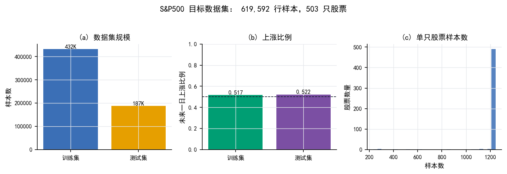

图 2 展示了本文方向预测任务框架：S&P500 面板数据首先被构造为历史窗口，随后输入 P-sLSTM 或 LSTM 模型，最终输出未来一日收益率并转化为方向标签。

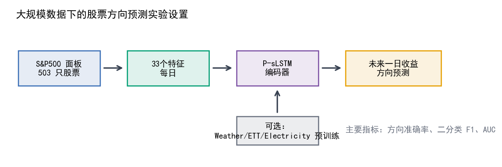

### 4.2 沪深 300 补充实验

为检验小样本金融场景下模型表现，本文使用沪深 300 股票数据作为补充实验。训练集为 2017-2018 年股票窗口，out-of-time 测试集为 2019 年 1 月至 3 月。目标为下一时刻涨跌幅 `p_change`，并映射到 6 类涨跌区间：

```text
<= -2%, (-2%, -1%], (-1%, 0%], (0%, 1%], (1%, 2%], > 2%
```

非金融源域包括 Weather、ETTm1、Electricity，以及特征筛选后的 Weather-6。

### 4.3 模型与训练设置

本文比较以下模型：

| 模型 | 说明 |
|---|---|
| LSTM target-only | 普通 LSTM，仅在目标股票数据上训练 |
| P-sLSTM target-only | 官方 P-sLSTM backbone，仅在目标股票数据上训练 |
| Weather -> P-sLSTM | Weather 源域预训练后在股票目标域微调 |
| P-sLSTM-DA focal | P-sLSTM 加 focal direction loss |
| P-sLSTM-DA BCE | P-sLSTM 加低权重 BCE direction loss |
| P-sLSTM direction head | P-sLSTM 加辅助方向分类头 |

S&P500 主实验使用 AdamW 优化器，训练 10 个 epoch。设备为 NVIDIA GeForce RTX 4080 Laptop GPU。

### 4.4 评价指标

方向准确率：

```text
Directional Accuracy = mean(1[sign(y) = sign(y_hat)])
```

Binary F1：

```text
F1 = 2 * Precision * Recall / (Precision + Recall)
```

Direction AUC：

```text
AUC = ROC-AUC(true direction, prediction score)
```

辅助回归指标：

```text
MAE = mean(|y - y_hat|)
RMSE = sqrt(mean((y - y_hat)^2))
```

为减少固定 0 阈值对方向指标的影响，本文在部分实验中使用验证集仿射校准：

```text
y_hat' = a * y_hat + b
```

该校准只改变输出阈值尺度，不更新模型参数。

## 5 S&P500 主实验结果

### 5.1 测试集方向预测指标

表 1 展示校准后的 S&P500 out-of-time 测试结果。

| 模型 | Direction Acc. | Binary F1 | Direction AUC | MAE | RMSE |
|---|---:|---:|---:|---:|---:|
| LSTM target-only | **0.515632** | 0.570933 | **0.517553** | **1.329785** | **2.070312** |
| P-sLSTM target-only | 0.510366 | **0.578282** | 0.507885 | 1.352723 | 2.089108 |
| Weather -> P-sLSTM | 0.510395 | 0.560719 | 0.510376 | 1.393843 | 2.137954 |

图 3 给出主要方向指标对比。LSTM 在方向准确率和 AUC 上略优，P-sLSTM target-only 在 Binary F1 上最优。该结果说明，P-sLSTM 具有较强拟合能力，但未来测试期方向判断并没有稳定超过普通 LSTM。

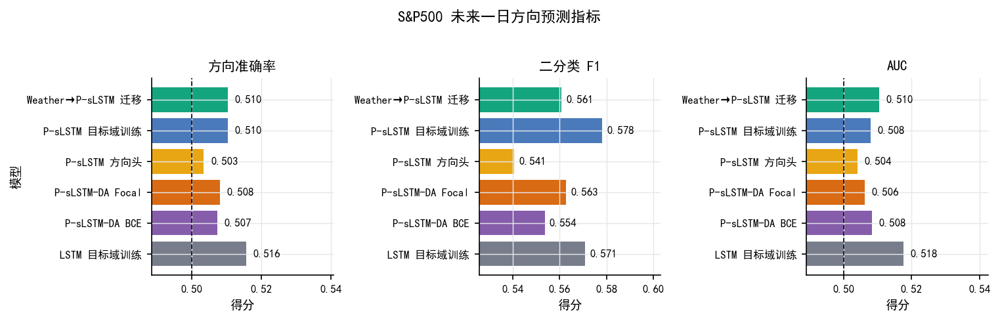

### 5.2 训练动态分析

图 4 展示训练与验证损失。P-sLSTM target-only 的最佳验证损失为 0.861746，低于 LSTM target-only 的 0.933614，说明 P-sLSTM 在训练期目标域上具备更强的回归拟合能力。Weather 预训练阶段损失下降明显，但迁移到 S&P500 后并未带来 out-of-time 方向提升。

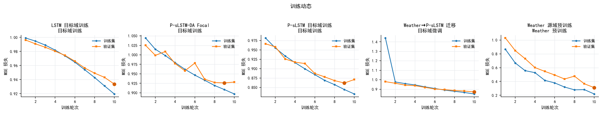

### 5.3 方向混淆矩阵

图 5 给出二分类方向混淆矩阵。可以看到，各模型存在不同程度的上涨偏向，这与测试期整体上涨比例和校准阈值有关。金融方向预测中，类别比例轻微不平衡也可能显著影响 F1 和方向准确率。

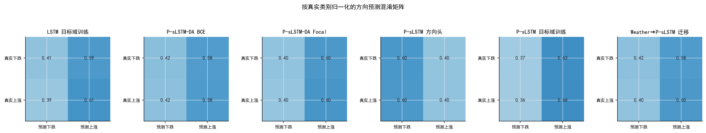

### 5.4 预测分位信号

图 6 将预测收益率按分位数分组，观察每个分位组内真实上涨比例。若模型具有较强方向排序能力，高预测分位组应对应更高真实上涨比例。结果显示，最高预测分位组通常具有更高上涨比例，但中间分位波动较大，说明模型捕捉到一定方向信号，但排序能力仍不稳定。

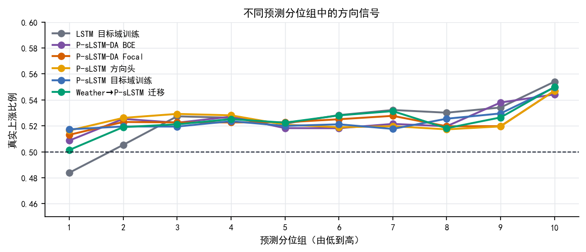

### 5.5 市场层面真实收益与预测收益对比

图 7 将所有股票的真实收益与预测收益在横截面上取均值，并使用 15 日滚动平均平滑。真实市场平均收益波动明显，而模型预测曲线更平滑，说明模型倾向于预测保守的平均趋势，难以捕捉极端市场波动。

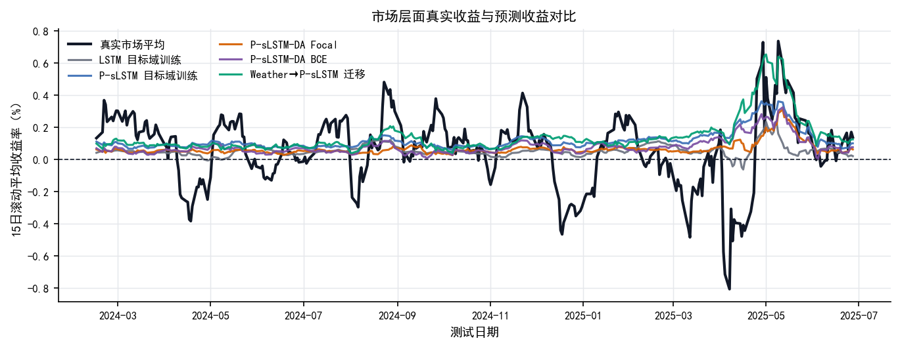

### 5.6 滚动方向准确率

图 8 展示 30 日滚动横截面方向准确率。不同时间阶段模型表现波动较大：部分阶段准确率明显高于 0.5，部分阶段又回落至随机基线附近。这一现象支持本文关于市场状态漂移的判断。

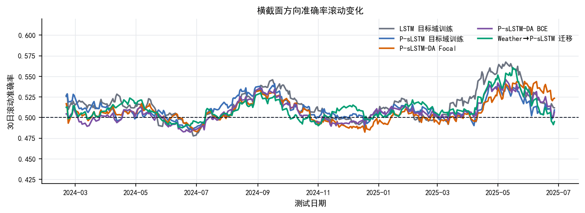

### 5.7 单股预测曲线

图 9 展示 AAPL、MSFT 和 NVDA 等代表性股票的真实收益与预测收益曲线。模型预测曲线明显更平滑，能够跟随部分趋势变化，但对极端波动和快速反转捕捉不足。该图直观体现了金融时间序列中“拟合趋势容易、预测突变困难”的特点。

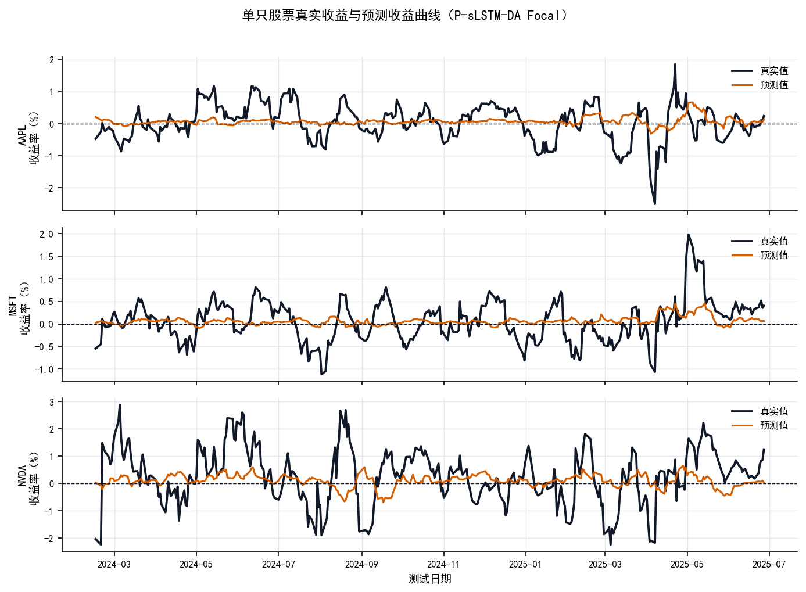

### 5.8 方向感知训练验证集提升

图 10 展示 P-sLSTM-DA focal 在验证集上的方向准确率变化。方向感知训练可将验证集方向准确率提升至约 0.591，说明直接优化方向目标确实增强了训练期分布内的方向学习能力。

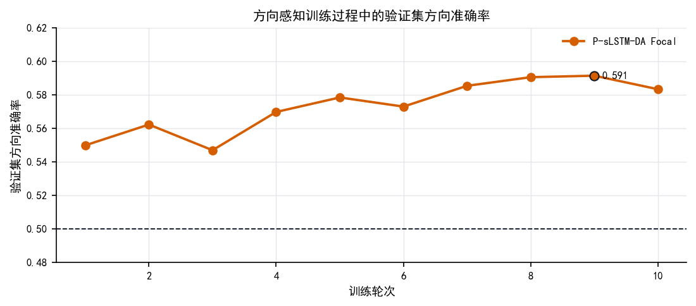

## 6 方向增强消融实验

表 2 给出 P-sLSTM 方向增强消融结果。

| 变体 | 最佳验证 Direction Acc. | 测试 Direction Acc. | 测试 Binary F1 | 测试 AUC |
|---|---:|---:|---:|---:|
| P-sLSTM target-only | 0.593287 | **0.510366** | **0.578282** | 0.507885 |
| P-sLSTM + focal direction loss | 0.591358 | 0.508148 | 0.562841 | 0.506211 |
| P-sLSTM + low-weight BCE direction loss | 0.588266 | 0.507359 | 0.553635 | **0.508249** |
| P-sLSTM + auxiliary direction head | **0.597265** | 0.503469 | 0.540510 | 0.504123 |

辅助方向头在验证集上获得最高方向准确率 0.597265，focal direction loss 也能达到 0.591358。然而这些验证集提升没有转化为 2024-2025 年测试集提升，甚至辅助方向头测试表现最弱。这说明方向增强模型可能学习到了训练/验证期的阶段性方向规律，而这些规律在未来测试期不再稳定。

因此，本文不将方向增强结果解释为“稳定提升股票方向预测能力”，而将其解释为：**方向目标确实可以提升同分布方向学习，但 out-of-time 泛化仍受市场漂移限制。** 这一结论比单纯追求验证集最高分更符合金融预测任务的现实约束。

## 7 沪深 300 补充实验

### 7.1 实验框架与训练曲线

沪深 300 补充实验的整体框架如图 11 所示。非金融源域用于预训练，沪深 300 股票数据用于目标域微调和评估。

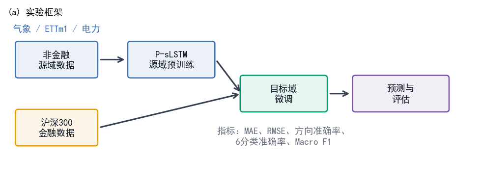

图 12 给出目标域训练与源域预训练曲线。不同源域的训练曲线表明，非金融序列可被 P-sLSTM 学习到较稳定的时间结构，但迁移效果仍需在金融目标域检验。

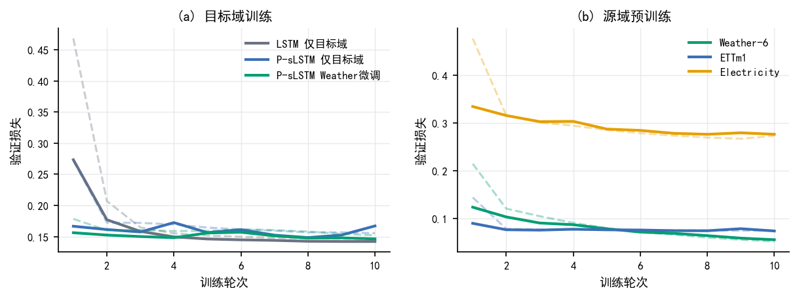

### 7.2 同分布验证结果

表 3 展示沪深 300 同分布验证结果。

| 模型 | 训练策略 | MAE | RMSE | Direction Acc. | 6-Class Acc. | Macro F1 |
|---|---|---:|---:|---:|---:|---:|
| LSTM | target-only | 1.5135 | 2.1844 | 0.5060 | 0.2478 | 0.1180 |
| P-sLSTM | target-only | 1.4959 | 2.1580 | 0.5464 | 0.2586 | 0.1529 |
| P-sLSTM | Weather pretrain + fine-tune | 1.4999 | 2.1569 | **0.5568** | 0.2671 | **0.1569** |
| P-sLSTM | Weather-6 pretrain + fine-tune | **1.4912** | **2.1490** | 0.5563 | **0.2681** | 0.1538 |
| P-sLSTM | ETTm1 pretrain + fine-tune | 1.4982 | 2.1585 | 0.5517 | 0.2636 | 0.1535 |
| P-sLSTM | Electricity pretrain + fine-tune | 1.5036 | 2.1628 | 0.5420 | 0.2564 | 0.1527 |

P-sLSTM target-only 相比 LSTM 显著提升方向准确率和 Macro F1；Weather 预训练进一步达到最高方向准确率 0.5568，Weather-6 则获得最佳 MAE/RMSE 和 6 分类准确率。图 13 可视化了这一结果。

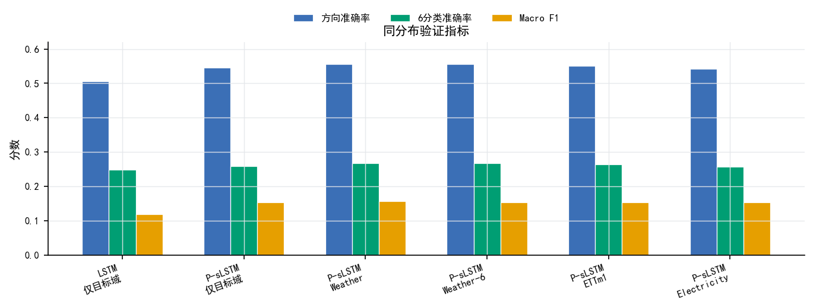

图 14 展示不同非金融源域的回归指标。Weather-6 在 MAE/RMSE 上表现最好，说明适当源域特征筛选可能降低负迁移风险。

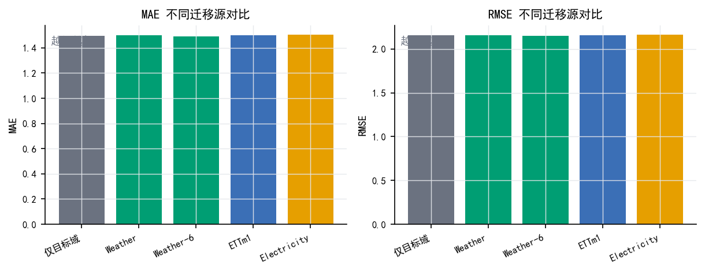

### 7.3 时间外推结果

表 4 给出 2019 年 out-of-time 测试结果。

| 模型 | 训练策略 | MAE | RMSE | Direction Acc. | 6-Class Acc. | Macro F1 |
|---|---|---:|---:|---:|---:|---:|
| LSTM | target-only | 2.1364 | 2.9885 | 0.4781 | 0.1769 | 0.0907 |
| LSTM | Weather pretrain + fine-tune | 2.1652 | 3.0196 | 0.4673 | 0.1867 | 0.0976 |
| P-sLSTM | target-only | 2.1918 | 3.0532 | **0.5132** | 0.1825 | 0.1150 |
| P-sLSTM | Weather pretrain + fine-tune | 2.2073 | 3.0851 | 0.4937 | **0.1874** | **0.1205** |

图 15 表明，时间外推条件下整体指标下降明显。P-sLSTM target-only 的方向准确率最高，但 Weather 迁移未能继续提高方向准确率。这与 S&P500 结果一致：迁移学习在训练期分布内可能有效，但未来测试泛化不稳定。

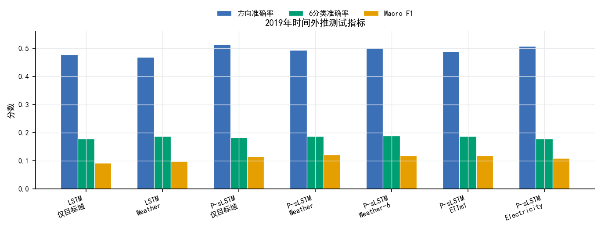

### 7.4 预测质量、混淆矩阵与迁移增益

图 16 展示最佳迁移模型预测值与真实值轨迹及散点分布。模型能够捕捉部分低频趋势，但对极端涨跌幅预测仍不足。

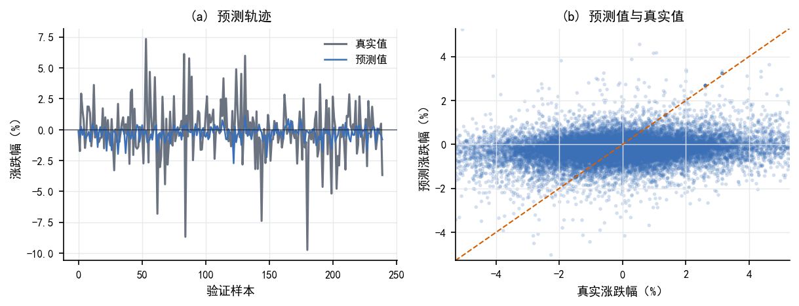

图 17 展示 6 分类混淆矩阵。可以看到，模型对中间涨跌区间的预测更集中，对极端涨跌类别识别较弱，这符合金融收益率尾部样本较少、极端变化难预测的特点。

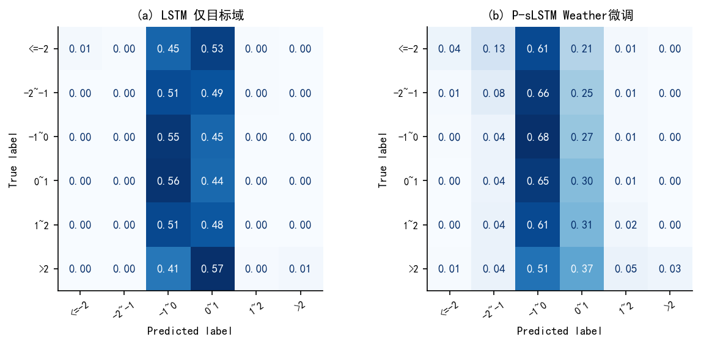

图 18 展示不同非金融源域相对 P-sLSTM target-only 的迁移增益。结果说明，源域选择对迁移效果影响明显：Weather/Weather-6 较为有效，Electricity 则可能带来负迁移。

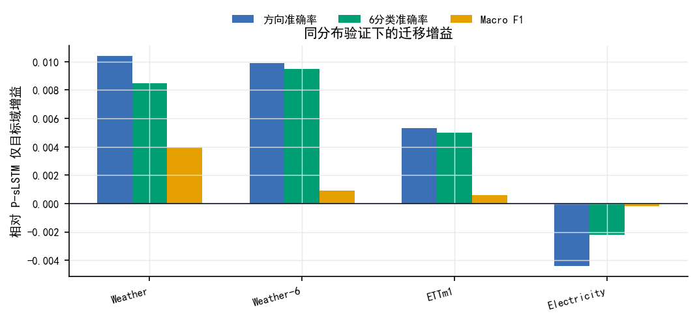

## 8 综合讨论

### 8.1 P-sLSTM 的有效性

从 S&P500 和沪深 300 实验可以看到，P-sLSTM 在验证损失或同分布验证指标上具有优势。这与原文结论一致：patching 有助于缓解长序列建模中的短记忆问题，channel independence 有助于降低多变量序列过拟合。股票数据虽然噪声更高，但仍包含局部趋势、波动聚集和技术指标结构，因此 P-sLSTM 可以作为有效的序列 backbone。

### 8.2 为什么验证集提升不等于未来测试提升？

本文最重要的发现是，方向增强可提升验证集方向准确率，但在未来测试集上效果衰减。这说明股票方向预测的难点不只是模型结构，也包括市场分布随时间变化。验证集通常与训练集共享相近市场状态，因此方向损失可能学习到阶段性有效模式；而未来测试期市场风格变化后，这些模式不再稳定。

因此，金融预测论文不能只报告随机验证集或训练期验证集结果。本文保留 out-of-time 测试结果，能够更真实地反映模型部署风险。

### 8.3 非金融迁移学习的边界

非金融时间序列预训练在沪深 300 同分布验证中表现较好，但在 S&P500 out-of-time 测试中未带来稳定提升。这说明非金融源域确实可能提供通用时间结构知识，例如趋势、周期和波动；但金融任务还需要适配市场机制和风险状态。未来若要提升迁移效果，可以考虑：

1. 使用金融相关源域，例如其他市场指数、行业指数或高频金融数据；
2. 引入 CORAL、MMD 等域对齐损失；
3. 使用滚动训练或在线更新缓解时间漂移；
4. 将市场状态变量作为条件输入；
5. 从单纯预测准确率扩展到交易回测和风险调整收益。

### 8.4 对课程论文结论的建议

本文不应被写成“P-sLSTM 显著提高未来股票方向准确率”的强结论。更稳妥的结论是：

```text
P-sLSTM 提升了股票序列拟合能力，并在同分布验证中表现良好；
但严格 out-of-time 测试显示，未来方向预测受市场漂移限制，
非金融迁移和方向增强均存在泛化不稳定问题。
```

这一结论既保留了正向贡献，也体现了对金融预测任务局限性的认识。

## 9 结论

本文参考 AAAI-25 P-sLSTM 原文，将 P-sLSTM 引入大规模股票方向预测任务，并结合非金融时间序列预训练、方向感知训练和跨市场补充实验进行系统分析。实验结果表明：

1. P-sLSTM 在目标域验证损失和沪深 300 同分布验证指标上优于普通 LSTM，说明其 patching 与 channel independence 设计对金融时间序列建模具有一定有效性。
2. Weather 等非金融源域预训练在部分同分布实验中有效，但在严格时间外推测试中收益不稳定，说明源域与目标金融域之间存在明显差异。
3. 方向感知损失和辅助方向头能提升验证集方向准确率，但未能改善 S&P500 2024-2025 年 out-of-time 测试表现，表明方向预测存在较强市场漂移。
4. 在未来一日股票方向预测中，模型性能整体接近 0.5-0.52 区间，说明该任务具有高噪声和低可预测性，不能仅凭训练期验证结果判断模型真实价值。

综上，P-sLSTM 是一个值得用于金融时间序列建模的有效 backbone，但若要形成稳定可交易的方向预测系统，还需要进一步结合市场状态建模、滚动更新、域适应与真实交易回测。

## 参考文献

[1] Kong, Y., Wang, Z., Nie, Y., Zhou, T., Zohren, S., Liang, Y., Sun, P., & Wen, Q. (2025). Unlocking the Power of LSTM for Long Term Time Series Forecasting. Proceedings of the AAAI Conference on Artificial Intelligence, 39(11), 11968-11976. https://ojs.aaai.org/index.php/AAAI/article/view/33303

[2] Hochreiter, S., & Schmidhuber, J. (1997). Long short-term memory. Neural Computation, 9(8), 1735-1780.

[3] Beck, M., Poppel, K., Spanring, M., Auer, A., Prudnikova, O., Kopp, M., Klambauer, G., Brandstetter, J., & Hochreiter, S. (2024). xLSTM: Extended Long Short-Term Memory. arXiv preprint.

[4] Nie, Y., Nguyen, N. H., Sinthong, P., & Kalagnanam, J. (2023). A Time Series is Worth 64 Words: Long-term Forecasting with Transformers. ICLR.

[5] Zeng, A., Chen, M., Zhang, L., & Xu, Q. (2023). Are Transformers Effective for Time Series Forecasting? AAAI.

[6] Zhou, H., Zhang, S., Peng, J., Zhang, S., Li, J., Xiong, H., & Zhang, W. (2021). Informer: Beyond Efficient Transformer for Long Sequence Time-Series Forecasting. AAAI.

[7] Zhang, Y., & Yan, J. (2023). Crossformer: Transformer Utilizing Cross-Dimension Dependency for Multivariate Time Series Forecasting. ICLR.

[8] Adilbai. S&P500 stock dataset. Hugging Face Datasets. https://huggingface.co/datasets/Adilbai/stock-dataset

[9] Eleanorkong. P-sLSTM official implementation. GitHub. https://github.com/Eleanorkong/P-sLSTM

## 附录 A：复现实验材料

代码与数据处理脚本：

```text
code/prepare_hf_sp500.py
code/run_pslstm_transfer.py
code/plot_sp500_figures.py
code/plot_paper_figures.py
```

结果文件：

```text
SP500_EXPERIMENT_RESULTS.md
EXPERIMENT_RESULTS.md
```

S&P500 中文图：

```text
figures_sp500_cn/
```

S&P500 英文图：

```text
figures_sp500/
```

沪深 300 图：

```text
figures/
```
